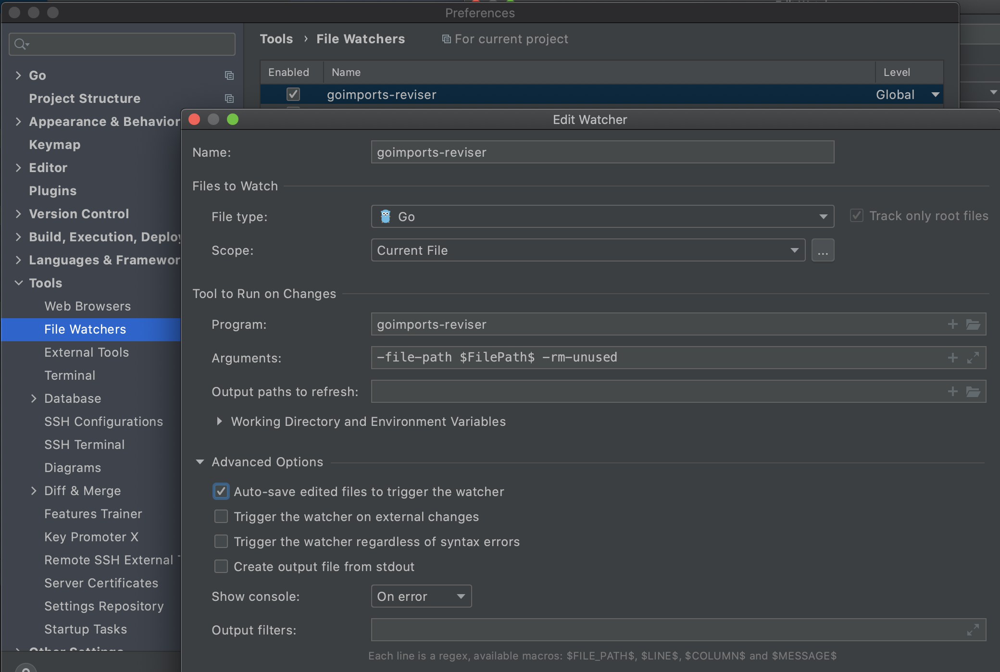

# goimports-reviser


Tool for Golang to sort goimports by 3-4 groups: std, general, local(which is optional) and project dependencies.
Also, formatting for your code will be prepared(so, you don't need to use `gofmt` or `goimports` separately). 
Use additional options `-rm-unused` to remove unused imports and `-set-alias` to rewrite import aliases for versioned packages or for packages with additional prefix/suffix(example: `opentracing "github.com/opentracing/opentracing-go"`).
`-local` - will create group for local imports. Values should be comma-separated.

*The last two options (`-rm-unused` & `-set-alias`) will work only for projects using Go Modules.*

## Install
```bash
go get github.com/jordanbangia/goimports-reviser
```

## How To Use


Before usage:
```go
package testdata

import (
	"log"

	"github.com/jordanbangia/goimports-reviser/testdata/innderpkg"

	"bytes"

	"github.com/pkg/errors"
)
``` 

After usage:
```go
package testdata

import (
	"bytes"
	"log"
	
	"github.com/pkg/errors"
	
	"github.com/jordanbangia/goimports-reviser/testdata/innderpkg"
)
```

Comments(not Docs) for imports is acceptable. Example:
```go
package testdata

import (
    "fmt" // comments to the package here
)
```  
### Example with `-local`-option

Before usage:

```go
package testdata // goimports-reviser/testdata

import (
	"fmt" //fmt package
	"github.com/pkg/errors" //custom package
	"github.com/jordanbangia/goimports-reviser/pkg" // this is a local package which is not a part of the project
	"goimports-reviser/pkg"
)
```

After usage:
```go
package testdata // goimports-reviser/testdata

import (
	"fmt" // fmt package

	"github.com/pkg/errors" // custom package

	"github.com/jordanbangia/goimports-reviser/pkg" // this is a local package which is not a part of the project

	"goimports-reviser/pkg"
)
```

### Options:
```text
Usage of goimports-reviser:
  -file-path string
        File path to fix imports(ex.: ./reviser/reviser.go). Required parameter.
  -project-name string
        Your project name(ex.: github.com/jordanbangia/goimports-reviser). Required parameter.
  -local string
        Local package prefixes which will be placed after 3rd-party group(if defined). Values should be comma-separated. Optional parameters.
  -rm-unused
        Remove unused imports. Optional parameter.
  -set-alias
        Set alias for versioned package names, like 'github.com/go-pg/pg/v9'. In this case import will be set as 'pg "github.com/go-pg/pg/v9"'. Optional parameter.
```

## Examples:
### Cmd
```bash
goimports-reviser -project-name github.com/jordanbangia/goimports-reviser -file-path ./reviser/reviser.go -rm-unused -set-alias
```

### Example, to configure it with JetBrains IDEs (via file watcher plugin):

